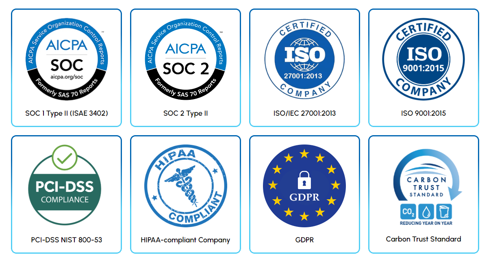

import { PackageManagerTabs } from 'rspress/theme';

# We 💜 Polyglot Observability

> Polyglot comes from Greek _polyglōttos_, a combination of **poly** - _"many" or "multi"_ - and **glōtta** for _"language_.

_That's us_. Gigapipe is a Polyglot platform designed around the Observability standards the world already loves 💜

   

#### ☝️ Why did we create Gigapipe? 

> _We needed a powerful all-in-one Observability stack and wanted to learn, so we made one for everyone!_

Let's take it back to the _pre-cloud era_. Our product goals and principles are simple:

✔️ We don't like metered solutions. Our plans are unlimited. 
✔️ We don't like dynamic pricing. Our service costs are fixed. 
✔️ We don't like vendor lock-ins. Our platform speaks freely. 
✔️ We don't like monopolies. Our products are not on AWS.

#### 💎 Independence

Our stack is _protocol compatible_ with many projects and products - _without depending on any_.  
Our core engine and APIs are all developed from scratch _("clear room")_ and _completely opensource_.

#### ⚡ Performance

Our stack uses **ClickHouse** + **DuckDB** OLAP engines w/ NVMe storage for fast analytics & scalable performance.  
We develop our data engines and database extensions standing on the shoulders of giants.

#### 🍖 Underdog-ness

Our pricing model is different because we are different - and so are our amazing dedicated hosting and VPS partners.  
We don't run on AWS. We are not VC controlled. Our products are made in EU - by humans for humans.

#### ⚖️ Compliance
Our partners infrastructure is compliant with regulations in each supported territory.

